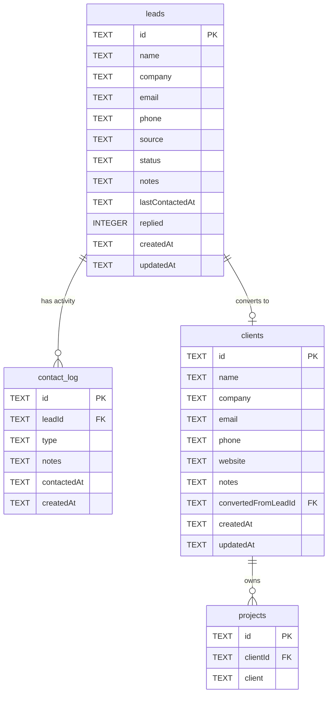

# Client management data schema

Foundation schema for the BRZRK client management module in Playblast. Runtime storage is **SQLite** (`DB_PATH`, default `/app/data/playblast.db`). TypeScript interfaces live under `server/src/types/`.

## Entity relationship diagram



## Tables

### `leads`

Sales pipeline contacts before conversion to a paying client.

| Column | Type | Constraints | Description |
|--------|------|-------------|-------------|
| `id` | `TEXT` | PK | UUID |
| `name` | `TEXT` | NOT NULL | Contact full name |
| `company` | `TEXT` | | Company or studio name |
| `email` | `TEXT` | NOT NULL | Primary contact email |
| `phone` | `TEXT` | | Optional phone number |
| `source` | `TEXT` | | Lead source (e.g. Instagram, Referral, Cold Outreach) |
| `status` | `TEXT` | NOT NULL, DEFAULT `'new'` | Pipeline status (see enum below) |
| `notes` | `TEXT` | | Freeform notes |
| `lastContactedAt` | `TEXT` | | ISO timestamp of most recent outreach |
| `replied` | `INTEGER` | NOT NULL, DEFAULT `0` | `1` when the lead has replied |
| `createdAt` | `TEXT` | NOT NULL | Record creation timestamp (ISO) |
| `updatedAt` | `TEXT` | NOT NULL | Last modification timestamp (ISO) |

**`status` enum:** `new` | `contacted` | `replied` | `negotiating` | `converted` | `lost`

TypeScript: `server/src/types/lead.ts` (`Lead`, `LeadStatus`)

### `contact_log`

Activity history for lead outreach and follow-ups.

| Column | Type | Constraints | Description |
|--------|------|-------------|-------------|
| `id` | `TEXT` | PK | UUID |
| `leadId` | `TEXT` | NOT NULL, FK → `leads.id` ON DELETE CASCADE | Parent lead |
| `type` | `TEXT` | NOT NULL | Contact type (see enum below) |
| `notes` | `TEXT` | | What was discussed or sent |
| `contactedAt` | `TEXT` | NOT NULL | ISO timestamp of the contact |
| `createdAt` | `TEXT` | NOT NULL | Record creation timestamp (ISO) |

**`type` enum:** `email` | `call` | `meeting` | `note`

TypeScript: `server/src/types/contact-log.ts` (`ContactLog`, `ContactLogType`)

### `clients`

Converted leads or manually added business contacts.

| Column | Type | Constraints | Description |
|--------|------|-------------|-------------|
| `id` | `TEXT` | PK | UUID |
| `name` | `TEXT` | NOT NULL | Contact full name |
| `company` | `TEXT` | | Company or studio name |
| `email` | `TEXT` | NOT NULL | Primary email |
| `phone` | `TEXT` | | Optional phone |
| `website` | `TEXT` | | Company website URL |
| `notes` | `TEXT` | | Freeform notes |
| `convertedFromLeadId` | `TEXT` | FK → `leads.id` ON DELETE SET NULL | Origin lead when converted |
| `createdAt` | `TEXT` | NOT NULL | Record creation timestamp (ISO) |
| `updatedAt` | `TEXT` | NOT NULL | Last modification timestamp (ISO) |

TypeScript: `server/src/types/client.ts` (`Client`)

### `projects` (update)

Existing proofing projects gain an optional link to a managed client.

| Column | Type | Constraints | Description |
|--------|------|-------------|-------------|
| `clientId` | `TEXT` | FK → `clients.id` ON DELETE SET NULL | Linked client record |
| `client` | `TEXT` | (unchanged) | Legacy free-text client label |

TypeScript: `server/src/types/project.ts` — `Project.clientId` added alongside existing `Project.client`.

## Relationships and foreign keys

| From | Column | To | On delete |
|------|--------|-----|-----------|
| `contact_log` | `leadId` | `leads.id` | CASCADE |
| `clients` | `convertedFromLeadId` | `leads.id` | SET NULL |
| `projects` | `clientId` | `clients.id` | SET NULL |

### Indexes

| Index | Column(s) | Purpose |
|-------|-----------|---------|
| `idx_leads_status` | `leads(status)` | Pipeline filtering |
| `idx_leads_email` | `leads(email)` | Lookup / dedup |
| `idx_contact_log_leadId` | `contact_log(leadId)` | Activity timeline per lead |
| `idx_clients_convertedFromLeadId` | `clients(convertedFromLeadId)` | Conversion traceability |
| `idx_projects_clientId` | `projects(clientId)` | Projects per client |

## Compatibility with existing `projects` schema

The `projects` table already stores proofing metadata (`name`, `status`, `budget`, dates, deliverables, etc.). Adding `clientId` is **additive and backward compatible**:

1. **Nullable FK** — Existing projects without a linked client continue to work; `clientId` defaults to `NULL`.
2. **Legacy `client` text preserved** — The optional `client` string column remains for display labels entered before client management existed. New UI should prefer `clientId` when a `clients` row exists; both fields may coexist during migration.
3. **No cascade to projects** — Deleting a `clients` row sets `projects.clientId` to `NULL` rather than deleting projects.
4. **Table creation order** — `leads` → `contact_log` / `clients` → `projects` ensures FK constraints validate on fresh databases. Upgrades use migration `001_client_management.sql`.
5. **Deliverables / versions / comments unchanged** — The proofing subgraph (`projects` → `deliverables` → `versions` → `comments`) is unaffected.

## SQL sources

| Artifact | Path |
|----------|------|
| Full baseline schema | `server/src/storage/schema.sql` |
| Upgrade migration | `server/src/storage/migrations/001_client_management.sql` |
| Migration runner | `server/src/storage/db.ts` (`schema_migrations` tracking table) |
| Dev seed data | `server/data/seed-client-management.sql` |
| Seed loader script | `scripts/seed-client-management.js` |

### Applying migrations

Migrations run automatically on server startup via `initDatabase()`. For manual application against an existing database:

```bash
node scripts/seed-client-management.js --migrate-only
```

### Loading seed data

```bash
node scripts/seed-client-management.js
```

Loads sample leads, contact log entries, clients, and links an example project when one exists. Safe to re-run only on empty client-management tables (the script skips when leads already exist).

## Conversion flow (intended usage)

```text
Lead (status: new → … → negotiating)
  ├── contact_log entries track outreach
  └── on conversion:
        1. Create clients row (convertedFromLeadId = lead.id)
        2. Set leads.status = 'converted'
        3. Optionally set projects.clientId on new/existing projects
```

Repository functions and HTTP routes for leads/clients are out of scope for this schema issue and will be added in follow-up work.
